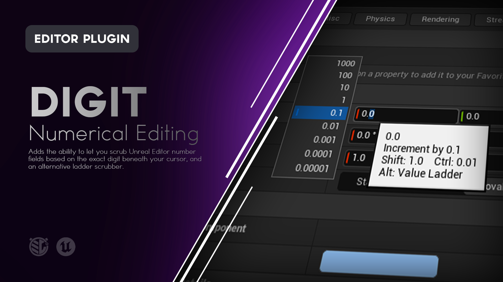

# Digit

**Digit-aware numeric scrubbing for Unreal Engine.**

Digit lets you scrub Unreal Editor number fields based on the exact digit beneath your cursor.

Hover the hundreds place to work in hundreds. Hover the tenths place to make fine decimal adjustments. Hold Alt to open a Value Ladder and change the active magnitude while you drag.




---

## What is Digit?

Unreal Engine already lets you scrub many numeric fields by dragging horizontally.

The problem is deciding **how much** that drag should change the value.

When working with:

```text
1234.567
```

you might want to adjust:

```text
1000s
100s
10s
1s
0.1s
0.01s
0.001s
```

Those are very different editing scales.

Digit makes the number itself the control.

Hover the digit representing the magnitude you want, then drag horizontally.

For example:

```text
1234.567
││││ │││
││││ ││└─ 0.001
││││ │└── 0.01
││││ └─── 0.1
│││└───── 1
││└────── 10
│└─────── 100
└──────── 1000
```

Hover the `2` and scrub in hundreds.

Hover the `4` and scrub in ones.

Hover the `6` and scrub in hundredths.

Digit gives precision control without adding another editing mode or replacing Unreal Engine's existing numeric fields.

---

# Features

### Digit-Aware Scrubbing

The exact digit beneath the cursor determines the magnitude of the numeric scrub.

### Per-Digit Highlighting

Digit highlights the individual numeric character currently targeted by the cursor.

### Place-Value Tooltips

Hover a digit to see:

- Current value
- Current increment
- Shift increment
- Ctrl increment
- Value Ladder shortcut

### Integer and Decimal Support

Work with whole-number and floating-point fields using the place values appropriate to each.

### Shift for Coarser Control

Hold **Shift** while scrubbing to increase the adjustment magnitude.

### Ctrl for Finer Control

Hold **Ctrl** while scrubbing for finer adjustment.

### Alt Value Ladder

Hold **Alt** to display a vertical ladder of nearby numeric magnitudes.

While dragging, move vertically through the ladder to change the active magnitude without starting another interaction.

### Nine Ladder Magnitudes

The Value Ladder displays up to:

- 4 magnitudes above the targeted digit
- The original targeted magnitude
- 4 magnitudes below it

Integer fields automatically prevent fractional ladder values.

### Native Drag Threshold

Digit preserves Unreal Engine's normal drag threshold before numeric scrubbing begins.

A click still behaves like a click instead of immediately changing the value.

### Native Numeric Constraints

Digit continues to use Unreal Engine's numeric spin box behavior, including supported:

- Minimum values
- Maximum values
- Slider ranges
- Slider exponents
- Numeric types

### Direction Feedback

While actively scrubbing, Digit outlines the numeric field to show whether the current movement is increasing or decreasing the value.

### Scrub Sensitivity

Adjust horizontal scrub sensitivity from Project Settings to match your preferred mouse movement.

A value of `1.0` is the default. Lower values require more horizontal movement, while higher values require less.

### Ladder Magnitude Sensitivity

Adjust how much vertical mouse movement is required to change Value Ladder magnitudes.

A value of `1.0` is the default and is tuned for more deliberate rung changes. Lower values require more vertical movement, while higher values switch magnitudes more quickly.

### Native Mouse Capture

Digit preserves Unreal Engine's normal mouse capture behavior during numeric scrubbing.

Depending on the field and editor context, the cursor may be hidden while the drag is active. Digit relies on the targeted-digit highlight and increase/decrease outline to keep the interaction readable.

### Customizable Highlight

Configure the digit highlight background and highlighted text color from Project Settings.

### Editor-Wide Integration

Digit works with supported scrub-enabled Unreal Editor numeric spin boxes rather than being tied to one specific Details panel.

### Editor Only

Digit adds no runtime gameplay systems and has no impact on packaged game behavior.

---
<!--
> [!IMPORTANT]
> **ATTENTION - README AUTHOR**
>
> This should be the main demonstration of Digit.
>
> **Recommended visual:** GIF
>
> Use a numeric field with a value such as:
>
> `1234.567`
>
> Demonstrate:
>
> 1. Move the cursor across several digits and show the highlight following the exact digit.
> 2. Hover the hundreds digit and drag horizontally.
> 3. Hover the ones digit and drag.
> 4. Hover a decimal digit and drag.
>
> Keep the mouse movement slow enough that viewers can clearly see which digit is targeted before each scrub.
>
> If possible, use a property where the numeric changes also produce a visible viewport result, such as Location or another transform value.
>
> Around 8 to 12 seconds is ideal.
>
> **Suggested file:**
>
> `Doc/Images/Digit-Scrubbing.gif`
>
> Once captured, replace this callout with:
>
> ```markdown
> 
> ```
-->
---

# Using Digit

Digit does not add a separate editor window or toolbar.

Once enabled, move the cursor over a supported numeric field.

When the cursor is directly over a digit, Digit highlights that character.

For example:

```text
1234.567
```

Hovering the `3` targets:

```text
10
```

Hovering the `5` targets:

```text
0.1
```

Click and drag horizontally to scrub using that magnitude.

---

# Targeting a Digit

Digit only activates when the cursor is directly over a numeric digit.

Characters such as:

- Decimal points
- Commas
- Plus signs
- Minus signs

are not treated as scrub targets.

For a formatted value such as:

```text
12,345.67
```

Digit still understands the numeric place values:

| Digit | Magnitude |
|---|---:|
| `1` | 10,000 |
| `2` | 1,000 |
| `3` | 100 |
| `4` | 10 |
| `5` | 1 |
| `6` | 0.1 |
| `7` | 0.01 |

The formatting characters do not change the meaning of the digits.

---

# Scrubbing

Once a digit is highlighted:

1. Press the left mouse button.
2. Begin dragging horizontally.
3. Drag right to increase the value.
4. Drag left to decrease the value.

Digit preserves Unreal Engine's normal physical drag threshold.

The value does not immediately change simply because the mouse button was pressed.

Once the threshold is crossed, numeric scrubbing begins.

During active mouse capture, Unreal Engine may hide the cursor until the drag ends. Digit's digit highlight and increase/decrease outline continue to provide visual feedback during the interaction.

## Scrub Sensitivity

Horizontal scrubbing can be tuned from:

**Project Settings > Plugins > Digit**

The **Scrub Sensitivity** setting scales horizontal mouse movement without changing the selected digit magnitude.

| Value | Behavior |
|---|---|
| `1.0` | Default scrub sensitivity |
| Below `1.0` | Requires more horizontal mouse movement |
| Above `1.0` | Requires less horizontal mouse movement |

Scrub Sensitivity applies to both normal digit scrubbing and horizontal movement while using the Value Ladder.

It does not change Unreal Engine's native drag threshold.

---

# Scrubbing by Place Value

Consider:

```text
1234.567
```

Targeting different digits changes the scale of the same physical mouse movement.

### Thousands

Hover:

```text
1
```

Increment:

```text
1000
```

### Hundreds

Hover:

```text
2
```

Increment:

```text
100
```

### Tens

Hover:

```text
3
```

Increment:

```text
10
```

### Ones

Hover:

```text
4
```

Increment:

```text
1
```

### Tenths

Hover:

```text
5
```

Increment:

```text
0.1
```

### Hundredths

Hover:

```text
6
```

Increment:

```text
0.01
```

### Thousandths

Hover:

```text
7
```

Increment:

```text
0.001
```

You do not need to change a global sensitivity setting just because the value needs a different editing scale.

Target the magnitude you want directly.

---

# Hover Tooltip

When Digit highlights a number, it temporarily adds an informational tooltip to that numeric field.

For example:

```text
1234.567
Increment by 100.0
Shift: 1000.0    Ctrl: 10.0
Alt: Value Ladder
```

The tooltip updates according to the digit beneath the cursor.

When Digit is no longer targeting that field, its original tooltip is restored.
<!--
> [!IMPORTANT]
> **ATTENTION - README AUTHOR**
>
> Capture the tooltip behavior here if the hero image does not already show it clearly.
>
> **Recommended visual:** Screenshot
>
> Use a value with both whole and fractional digits.
>
> Hover one digit and make sure the tooltip clearly shows:
>
> - Current value
> - Increment
> - Shift
> - Ctrl
> - Alt: Value Ladder
>
> Crop tightly enough that the text remains readable on GitHub.
>
> **Suggested file:**
>
> `Doc/Images/Digit-Tooltip.png`
>
> Once captured, replace this callout with:
>
> ```markdown
> 
> ```
-->
---

# Shift and Ctrl

Digit preserves quick modifier-based changes to the current editing scale.

## Shift

Hold:

**Shift**

while scrubbing to work one order of magnitude coarser.

For example:

```text
Normal = 10
Shift  = 100
```

or:

```text
Normal = 0.1
Shift  = 1
```

---

## Ctrl

Hold:

**Ctrl**

while scrubbing to work one order of magnitude finer where supported by the numeric field.

For example:

```text
Normal = 10
Ctrl   = 1
```

or:

```text
Normal = 0.1
Ctrl   = 0.01
```

The hover tooltip shows the current Shift and Ctrl magnitudes before you begin dragging.

---

# Value Ladder

Sometimes the exact magnitude you need changes during the same adjustment.

Hold:

**Alt**

while hovering a digit to open the **Value Ladder**.

The ladder displays nearby magnitudes centered around the digit you originally targeted.

For example, targeting the ones place can produce:

```text
10000
1000
100
10
1       <- Origin
0.1
0.01
0.001
0.0001
```

The original magnitude is marked so you can always see where the interaction began.
<!--
> [!IMPORTANT]
> **ATTENTION - README AUTHOR**
>
> This is an essential Digit visual.
>
> **Recommended visual:** GIF
>
> Show:
>
> 1. Hover a digit in a floating-point numeric field.
> 2. Hold **Alt**.
> 3. Show the Value Ladder appear beside the field.
> 4. Begin dragging.
> 5. Move vertically upward through several larger magnitudes.
> 6. Scrub horizontally.
> 7. Move vertically downward into smaller magnitudes.
> 8. Scrub horizontally again.
> 9. Release the mouse.
>
> Use a field where the resulting value changes are easy to watch.
>
> The ladder is deliberately placed to the **left of the numeric field when space allows**, helping keep it clear of Unreal's normal lower-right tooltip placement.
>
> **Suggested file:**
>
> `Doc/Images/Digit-Value-Ladder.gif`
>
> Once captured, replace this callout with:
>
> ```markdown
> 
> ```
-->
---

# Using the Value Ladder

The Value Ladder combines two directions of mouse movement.

### Vertical Movement

Changes the active numeric magnitude.

Move upward for larger values.

Move downward for smaller values.

### Horizontal Movement

Changes the numeric value using the currently selected ladder magnitude.

This allows a single drag to move between broad and precise adjustments.

For example:

1. Start on the ones place.
2. Move up to `100`.
3. Make a large horizontal adjustment.
4. Move down to `0.1`.
5. Fine-tune the result.
6. Release.

You do not need to end the drag and target another digit.

## Ladder Magnitude Sensitivity

Vertical ladder movement can be tuned independently from horizontal scrubbing.

Open:

**Project Settings > Plugins > Digit**

and adjust **Ladder Magnitude Sensitivity**.

| Value | Behavior |
|---|---|
| `1.0` | Default ladder magnitude sensitivity |
| Below `1.0` | Requires more vertical movement to change magnitude |
| Above `1.0` | Requires less vertical movement to change magnitude |

This setting affects only vertical movement between Value Ladder magnitudes.

It does not change:

- Horizontal scrub sensitivity
- The selected digit's magnitude
- Shift or Ctrl behavior
- Unreal Engine's native drag threshold

The setting is applied when a ladder drag begins, so a sensitivity change affects the next interaction rather than changing an active drag midway through it.

---

# Ladder Range

The Value Ladder displays nine positions centered on the digit that opened it:

```text
+4 magnitudes
+3
+2
+1
Origin
-1
-2
-3
-4 magnitudes
```

For very large or very small magnitudes, Digit uses scientific notation to keep the ladder compact.

For example:

```text
1e+7
```

or:

```text
1e-7
```

---

# Integer Fields

Integer fields cannot contain fractional values.

The Value Ladder recognizes this.

If the ladder extends below the ones place on an integer field, those fractional magnitudes are disabled.

For example:

```text
10000
1000
100
10
1       <- Lowest valid integer magnitude
0.1     Disabled
0.01    Disabled
0.001   Disabled
0.0001  Disabled
```

Digit therefore does not turn an integer property into a floating-point property simply because the ladder reaches fractional magnitudes.

---

# Ladder Placement

Digit attempts to place the Value Ladder to the **left of the numeric field**.

This keeps it away from the area normally occupied by Unreal Engine tooltips and leaves the numeric value visible while adjusting it.

If there is not enough space on the left side of the window, Digit automatically places the ladder on the right instead.

The ladder is also clamped to the current window so it remains visible near screen edges.

---

# Increase and Decrease Feedback

Once an active numeric drag begins, Digit outlines the complete numeric field.

The outline communicates the direction of the current horizontal movement:

- Increasing value
- Decreasing value

The outline changes when drag direction changes and disappears when the interaction ends.

This gives you feedback at the field level while the individual digit highlight continues to show the magnitude that started the interaction.
<!--
> [!IMPORTANT]
> **ATTENTION - README AUTHOR**
>
> Capture Digit's directional feedback here.
>
> **Recommended visual:** Two screenshots side by side
>
> Use the same numeric field and targeted digit.
>
> **Left:** Dragging right so the Increase outline is visible.
>
> **Right:** Dragging left so the Decrease outline is visible.
>
> Crop tightly around the field so the outline and highlighted digit remain easy to see.
>
> **Suggested files:**
>
> - `Doc/Images/Digit-Increase.png`
> - `Doc/Images/Digit-Decrease.png`
>
> Once captured, replace this callout with:
>
> ```markdown
> | Increasing | Decreasing |
> |---|---|
> |  |  |
> ```
-->
---

# Native Numeric Behavior

Digit changes the scale of numeric scrubbing rather than replacing Unreal Engine's underlying numeric widget behavior.

Supported fields continue to respect their configured numeric behavior, including:

- Hard value limits
- Slider limits
- Slider exponent
- Numeric type
- Existing field formatting
- Native mouse capture
- Native drag threshold

During a Digit interaction, the plugin temporarily configures the numeric field with enough precision to perform the requested scrub.

When the interaction ends, the field's original delta setting is restored.

This keeps Digit focused on **how much the drag means**, while Unreal Engine continues to own the numeric property itself.

---

# Supported Numeric Types

Digit supports Unreal Engine scrub-enabled numeric spin boxes using:

### Floating Point

- `float`
- `double`

### Signed Integer

- `int8`
- `int16`
- `int32`
- `int64`

### Unsigned Integer

- `uint8`
- `uint16`
- `uint32`
- `uint64`

The field must support normal slider-style numeric scrubbing.

Plain text fields or numeric widgets that do not expose Unreal Engine's standard scrub behavior are outside Digit's current scope.

---

# Where Digit Works

Digit is implemented at the Unreal Editor Slate input level rather than being tied specifically to Actor Details.

This allows it to work anywhere the Editor exposes a compatible scrub-enabled numeric spin box.

Common examples can include numeric properties in:

- Details panels
- Transform fields
- Editor utility interfaces using standard numeric widgets
- Other native Unreal Editor panels built around compatible spin boxes

Individual custom editor interfaces may behave differently if they use their own numeric controls instead of Unreal Engine's standard spin box implementation.

---

# Project Settings

Open:

**Project Settings > Plugins > Digit**

to customize Digit's interaction and appearance.

The current settings are:

| Setting | Purpose |
|---|---|
| **Scrub Sensitivity** | Scales horizontal scrubbing. `1.0` is the default. Lower values require more mouse movement; higher values require less. |
| **Ladder Magnitude Sensitivity** | Scales vertical Value Ladder magnitude selection. `1.0` is the default. Lower values require more deliberate vertical movement; higher values switch magnitudes more quickly. |
| **Highlight Color** | Background color displayed behind the targeted digit. |
| **Highlighted Text Color** | Text color used for the targeted digit. |
| **Increase Outline Color** | Outline color shown while the value is increasing. |
| **Decrease Outline Color** | Outline color shown while the value is decreasing. |

Digit's default highlight uses a translucent Unreal-style blue with white highlighted text.
<!--
> [!IMPORTANT]
> **ATTENTION - README AUTHOR**
>
> Capture the Digit Project Settings here.
>
> **Recommended visual:** Screenshot
>
> Show:
>
> **Project Settings > Plugins > Digit**
>
> with both settings visible:
>
> - Highlight Color
> - Highlighted Text Color
>
> This image is optional because Digit's configuration is intentionally small.
>
> **Suggested file:**
>
> `Doc/Images/Digit-Settings.png`
>
> Once captured, replace this callout with:
>
> ```markdown
> 
> ```
-->
---

# Example Workflow

Imagine you're adjusting the X position of an Actor:

```text
12345.678
```

You need to move it a large distance first, then make a precise final adjustment.

With Digit:

1. Hover the `2` to target the thousands place.
2. Drag horizontally to make the large move.
3. Hover the `5` to target the ones place.
4. Make a smaller correction.
5. Hover the `7` to target hundredths.
6. Fine-tune the final value.

Or perform the same process in one interaction:

1. Hover the ones place.
2. Hold **Alt**.
3. Start dragging.
4. Move upward through the Value Ladder for the large adjustment.
5. Move downward to a fractional magnitude.
6. Fine-tune the result.
7. Release.

The number itself becomes the interface for choosing precision.

---

# Saving Digit Settings

Digit does not store anything on:

- Actors
- Components
- Levels
- Assets
- Numeric properties

Its settings are stored through the project's Digit configuration.

Using Digit does not add metadata to the property you edit.

The resulting numeric value is simply the value Unreal Engine would normally save for that property.

---

# Installation

Digit can be installed through **Fab**, from a **precompiled GitHub Release**, or directly from the **GitHub source**.

For most users, the Fab or GitHub Release installation is recommended.

---

## Fab / Epic Games Launcher

> **Availability:** Use this installation method once Digit is available through Fab.

1. Add **Digit** to your library on Fab.
2. Open the **Epic Games Launcher**.
3. Navigate to your Unreal Engine Library.
4. Locate Digit in your Fab / Vault library.
5. Install Digit to the supported Unreal Engine version.
6. Launch your Unreal Engine project.
7. Open **Edit > Plugins**.
8. Search for **Digit**.
9. Enable the plugin if it is not already enabled.
10. Restart Unreal Editor if prompted.

Once enabled, Digit automatically works with compatible numeric fields throughout the Editor.

---

## GitHub Release

This is the easiest manual GitHub installation method because the release package is already prepared for the supported Unreal Engine version.

### 1. Download Digit

Open the repository's **Releases** page:

https://github.com/mippi-the-dork/Digit/releases

Download the latest packaged plugin matching your Unreal Engine version and platform.

For example:

```text
Digit-v1.0.0-UE5.8.3-Win64.zip
```

Do not use GitHub's automatically generated **Source code** ZIP as a precompiled plugin package.

### 2. Close Unreal Editor

Close the project before installing the plugin.

### 3. Locate Your Project Plugins Folder

Your project should contain a `Plugins` directory beside the `.uproject` file:

```text
YourProject/
├── Config/
├── Content/
├── Plugins/
└── YourProject.uproject
```

If the `Plugins` directory does not exist, create it.

### 4. Extract Digit

Extract the `Digit` folder into:

```text
YourProject/Plugins/
```

The final structure should look similar to:

```text
YourProject/
├── Plugins/
│   └── Digit/
│       ├── Config/
│       ├── Doc/
│       ├── Resources/
│       ├── Source/
│       └── Digit.uplugin
└── YourProject.uproject
```

### 5. Launch the Project

Open your Unreal Engine project.

If necessary, navigate to:

**Edit > Plugins**

Search for:

```text
Digit
```

Enable the plugin and restart Unreal Editor if prompted.

---

## GitHub Source

Developers who want the source or want to modify Digit can clone the repository directly.

### Requirements

Building Digit from source requires a working Unreal Engine C++ development environment.

For Windows this generally means:

- Unreal Engine 5.8.x
- Visual Studio with the appropriate C++ workloads
- A project capable of compiling C++ plugins

### Clone the Repository

Close Unreal Editor and navigate to your project's `Plugins` directory.

```bash
cd YourProject/Plugins
git clone https://github.com/mippi-the-dork/Digit.git
```

Your project should now contain:

```text
YourProject/Plugins/Digit/
```

### Generate Project Files

If necessary:

1. Right-click your `.uproject`.
2. Select **Generate Visual Studio project files**.

Then open the generated solution and build your project's Editor target.

For example:

```text
YourProjectEditor
Win64
Development Editor
```

Launch the project after compilation completes.

---

# Updating Digit

## GitHub Release Installation

When updating a manually installed release:

1. Close Unreal Editor.
2. Remove the existing `Plugins/Digit` folder.
3. Extract the new Digit release into the `Plugins` directory.
4. Reopen the project.

Replacing the complete plugin folder is recommended rather than copying individual files over an older version.

---

## Git Source Installation

If you cloned the repository using Git:

```bash
cd YourProject/Plugins/Digit
git pull
```

Rebuild the project if the source has changed.

---

# Compatibility

The current Digit release targets:

| | |
|---|---|
| **Digit Version** | 1.0.0 |
| **Unreal Engine** | 5.8.x |
| **Platform** | Windows 64-bit |
| **Plugin Type** | Editor |
| **Runtime Dependency** | None |
| **Runtime Actors** | None |
| **Runtime Components** | None |
| **Packaged Game Impact** | None |

Digit is currently configured as a Win64 Editor plugin.

Compatibility with additional Unreal Engine versions or platforms should not be assumed unless explicitly listed in a release.

---

# How Digit Works

Digit integrates with Unreal Engine's Slate input system.

When the cursor moves over a compatible numeric field:

1. Digit identifies the underlying numeric spin box.
2. It identifies the text displaying the current value.
3. It determines the exact character beneath the cursor.
4. If that character is a digit, Digit determines its numeric place value.
5. A temporary overlay highlights that digit.
6. Digit adds a tooltip describing the available scrub magnitudes.

When a drag begins:

1. Unreal Engine receives the normal mouse-down interaction.
2. Digit preserves Unreal's native drag threshold.
3. Once normal scrubbing begins, Digit scales horizontal movement according to the selected place value and configured Scrub Sensitivity.
4. The modified movement is routed through the existing numeric spin box.
5. The field continues to enforce its normal numeric range and behavior.
6. Digit restores the field's original scrub configuration when the interaction ends.

When the Value Ladder is active, vertical movement changes the selected magnitude using the configured Ladder Magnitude Sensitivity while horizontal movement continues to control the value using Scrub Sensitivity.

Digit therefore does not replace Unreal Engine's numeric editing system.

It changes the meaning of the scrub based on the digit the user deliberately targeted.

---

# What Digit Does Not Do

Digit is an **editor numeric-input utility**.

It does not:

- Add runtime systems
- Add Actors
- Add Components
- Modify packaged-game behavior
- Change stored numeric types
- Convert integer properties into floating-point properties
- Remove existing numeric limits
- Replace Unreal Engine's Details panel
- Replace numeric fields with custom widgets
- Change values merely by hovering them
- Require a separate editing mode
- Require a toolbar
- Permanently change a field's native scrub settings

Digit works with existing compatible numeric controls rather than replacing them.

---

# Limitations

### Supported Numeric Widgets

Digit currently targets standard Unreal Engine scrub-enabled `SSpinBox` numeric controls.

Custom numeric widgets that do not use compatible Unreal Engine spin boxes are outside its current scope.

### Slider Scrubbing Must Be Enabled

If a numeric spin box does not allow slider-style mouse scrubbing, Digit does not force that behavior on.

### Visible Digits

Digit determines magnitude from the numeric text currently displayed by the field.

A digit must be present in the formatted value before it can be directly targeted.

### Integer Precision

Integer fields cannot use fractional ladder magnitudes.

Fractional ladder positions are disabled automatically.

### Number Formatting

Digit is designed around normal Unreal numeric formatting using digits, decimal points, grouping commas, and positive or negative signs.

Specialized custom formatting may not provide enough information for Digit to determine the intended place value.

### Editor Only

Digit exists only inside Unreal Editor.

It does not alter numeric input behavior in the packaged game.

---

# Troubleshooting

## Digit Does Not Highlight a Number

Check:

**Edit > Plugins**

Search for:

```text
Digit
```

Confirm that the plugin is enabled.

Restart Unreal Editor if it was just enabled.

Also make sure the cursor is directly over a **digit**, not the decimal point, comma, sign, or empty part of the field.

---

## A Numeric Field Does Not Respond to Digit

The field may not use a supported scrub-enabled Unreal Engine numeric spin box.

Try dragging the field normally.

If Unreal Engine itself does not allow horizontal numeric scrubbing on that field, Digit will not force it to become scrubbable.

---

## The Value Ladder Does Not Appear

Hover directly over a highlighted digit, then hold:

**Alt**

The ladder should appear beside the numeric field.

To change ladder magnitude during editing, continue holding Alt while click-dragging.

---

## The Ladder Appears on the Right Side

Digit prefers to place the Value Ladder on the left side of the field.

If there is not enough room, it automatically moves the ladder to the right so it remains inside the Editor window.

---

## Fractional Ladder Values Are Disabled

Check whether the numeric field is an integer.

Integer fields cannot accept fractional values, so Digit disables ladder positions below the ones place.

---

## Scrubbing Feels Too Fast or Too Slow

Open:

**Project Settings > Plugins > Digit**

and adjust **Scrub Sensitivity**.

Use a value below `1.0` for slower, more deliberate horizontal scrubbing.

Use a value above `1.0` for faster scrubbing with less mouse movement.

---

## The Value Ladder Changes Magnitude Too Easily

Open:

**Project Settings > Plugins > Digit**

and reduce **Ladder Magnitude Sensitivity**.

Lower values require more vertical mouse movement before the active ladder magnitude changes.

This setting is independent from horizontal Scrub Sensitivity.

---

## The Highlight Disappears While Scrubbing

The originally targeted place value can temporarily disappear from the displayed number.

For example, if the hundreds place was targeted in:

```text
123
```

and the value is scrubbed below:

```text
100
```

that hundreds digit no longer exists in the displayed string.

Digit keeps the active magnitude internally and temporarily hides only the visual marker.

---

## Shift or Ctrl Does Not Produce a Fractional Integer Value

Integer properties remain integer properties.

Digit can change the scrub behavior, but it does not alter the property's underlying numeric type.

---

## A Value Stops at a Minimum or Maximum

Digit respects the numeric field's existing limits.

It does not bypass hard or slider ranges configured by the field.

---

# Reporting Bugs

If you encounter a problem, please open an issue:

https://github.com/mippi-the-dork/Digit/issues

When reporting a bug, include:

- Digit version
- Unreal Engine version
- Windows version
- Whether Digit was installed from Fab, a GitHub Release, or source
- The numeric field or property being edited
- The displayed value
- Which digit was targeted
- Whether Shift, Ctrl, or Alt was being used
- Whether the Value Ladder was active
- Scrub Sensitivity value when relevant
- Ladder Magnitude Sensitivity value when relevant
- Steps to reproduce the problem
- Screenshots or video when relevant
- Any relevant Unreal Editor log output

For place-value issues, include the exact displayed number and the digit you expected Digit to target.

---

# Feature Requests

Suggestions and feature requests are welcome through GitHub Issues.

When proposing a feature, describe the numeric-editing workflow problem you're trying to solve rather than only the implementation you would like to see.

This helps keep Digit focused on faster and more precise numeric editing inside Unreal Engine.

---

# Contributions

Pull requests are welcome.

If you're considering a significant change, opening an Issue first is recommended so the intended behavior can be discussed before substantial work is done.

Digit is intended to remain focused on digit-aware numeric input and scrubbing.

---

# License

Digit is distributed under the **MIT License**.

See [`LICENSE`](LICENSE) for details.

---

# About

Digit is an Unreal Engine editor utility created by **Mippi the Dork**.

The plugin was built around a simple idea:

> The digit you grab should tell Unreal how precise you want to be.

Digit turns the number itself into the precision control.